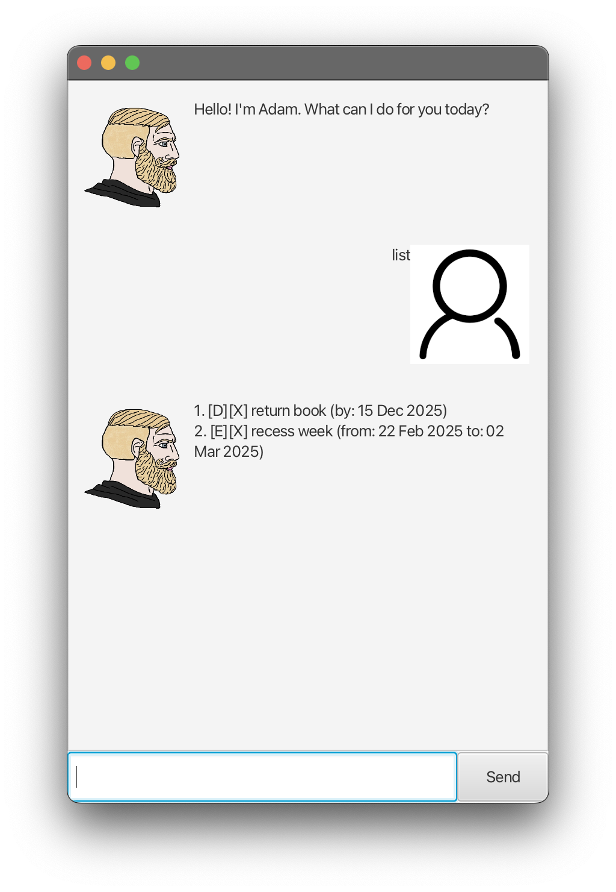

# Adam User Guide



Need any help to keep track of your tasks? Gigachad Adam is here to help!
It is easy to use, controlled entirely with text commands.

## Commands

### Adding Tasks

There are 4 types of tasks: Todos, Deadlines, Events, and Fixed Duration tasks. Tasks added will stay added, even after exiting and re-launching the app.

#### Todo

A **Todo** is a task with only a description. This should be for simple tasks with no timeframe.

Syntax: `todo [description]`

##### _Example:_
```
todo Buy milk
```

##### _Expected Response:_
```
Got it. I've added this task:
 [T][ ] Buy milk
```

#### Deadline

A **Deadline** is a task with a description, and a deadline in the form of a date, given in `DD-MM-YYYY` format.

Syntax: `deadline [description] /by DD-MM-YYYY`

##### _Example:_
```
deadline reply prof's email /by 25-02-2025
```

##### _Expected Response:_
```
Got it. I've added this task:
 [D][ ] reply prof's email (by: 25 Feb 2025)
```

#### Events

An **Event** is a task with a description, as well as a start and end date (inclusive), both given in the format of `DD-MM-YYYY`. Note it is implicitly assumed that the start date will not be after the end date.

Syntax: `event [description] /from DD-MM-YYYY /to DD-MM-YYYY`

##### _Example:_
```
event recess week /from 22-02-2025 /to 02-03-2025
```

##### _Expected Response:_
```
Got it. I've added this task:
 [E][ ] recess week (from: 22 Feb 2025 to: 02 Mar 2025)
```

#### Fixed Duration

A **Fixed Duration** is a task that that would need a fixed duration to complete. For instance, attempt CS2103 past practice paper.

Syntax:
```
fixed [description] /takes [expected duration]
```
The expected duration will be given in terms of hours and minutes, such as `1h 30m`.

##### _Example:_
```
fixed Attempt cs2103 2425s1 paper /takes 1h 30m
```

##### _Expected Response:_
```
Got it. I've added this task:
 [F][ ] Attempt cs2103 2425s1 paper (Duration: 1h 30m)
```

### Listing tasks
After having some tasks in the system, you can simply list them with the command `list`.

#### _Example output:_
```
 1. [T][ ] buy milk
 2. [D][ ] reply prof's email (by: 25 Feb 2025)
 3. [E][ ] recess week (from: 22 Feb 2025 to: 02 Mar 2025)
 4. [F][ ] Attempt cs2103 2425s1 paper (Duration: 1h 30m)
```

You can also specify a date with the `listOn` command. Simply write `listOn DD-MM-YYYY`

For instance, with `listOn 25-02-2025`, we get:
```
 2. [D][ ] reply prof's email (by: 25 Feb 2025)
 3. [E][ ] recess week (from: 22 Feb 2025 to: 02 Mar 2025)
```
listed with the indices in the full list

### Marking and unmarking
To mark tasks as done or not done, just use `mark [index]` or `unmark [index]`, where index refers to the index of the task in the full list (starting from 1).

For instance, `mark 1` would get:
```
Nice! I've marked this task as done:
 [T][X] buy milk
```

If we then did `unmark 1`, we would get:
```
OK, I've marked this task as not done yet:
 [T][ ] buy milk
```

### Deleting tasks
To delete a task, use `delete [index]` similar to marking and unmarking a task.

For instance, `delete 1` would get:
```
OK, I've deleted this task:
[T][ ] buy milk
```
Note that remaining tasks will be re-indexed starting from 1.

### Finding tasks
Tasks can be searched for by simple substring queries. `find [query string]` lists all tasks that have the query string appear in the description. For instance, `find re` would get:
```
 1. [D][ ] reply prof's email (by: 25 Feb 2025)
 2. [E][ ] recess week (from: 22 Feb 2025 to: 02 Mar 2025)
```
As "*re*ply prof's email" and "*re*cess week"

### Exiting the app
You can end the conversation by using the command: `bye`.

Alternatively, you can also close the window. The app will still exit normally.
